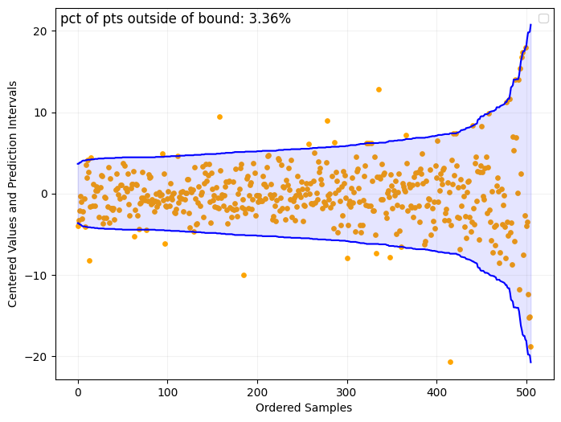
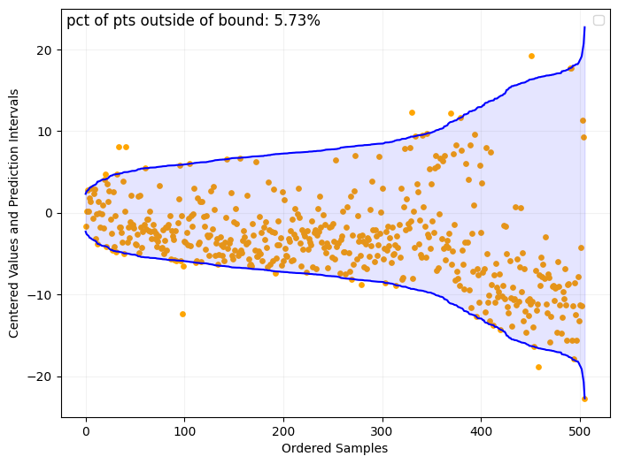

This repo implements methodology proposed in Quantile Regression using Random Forest Proximities by Li etc.

# Boston Housing Example
Using Boston housing data as a toy example,
```python
import openml

from plot_utils import plot_centered_bounds
from rf_quantile_regression import predit_bounds


boston = openml.datasets.get_dataset(531)

# Convert to a Pandas DataFrame
X, y, _, _ = boston.get_data(target=boston.default_target_attribute)
X['RAD'] = X['RAD'].astype(int)
X['CHAS'] = X['CHAS'].astype(int)

upper_bound, lower_bound, rf = predit_bounds(
    X, y, coverage=0.95, n_estimators=500, max_depth=6
    )
plot_centered_bounds(y, upper_bound, lower_bound)
print(f'average length of the bounds rf: {np.mean(upper_bound - lower_bound)}')
```

The average length of the bound is 12.75 and there are 3.36% (with 95% coverage as target) of the points not covered by the bounds. Note that the hyperparameters is not tuned.

To compare the results with the quantile regression of sk-learn
```python
from sklearn.linear_model import QuantileRegressor
from plot_utils import plot_centered_bounds


X, y, _, _ = boston.get_data(target=boston.default_target_attribute)
X['RAD'] = X['RAD'].astype(int)
X['CHAS'] = X['CHAS'].astype(int)

upper_bound_lm = qr.fit(X, y).predict(X)
plot_centered_bounds(y, upper_bound_lm, lower_bound_lm)
```


The average length of the bound is 18.47 and there are 5.73% (with 95% coverage as target) of the points not covered by the bounds.

See `src/example.py` for the code.